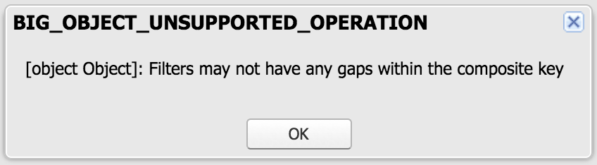
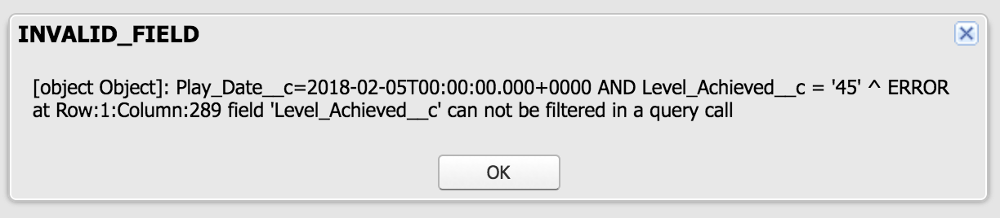
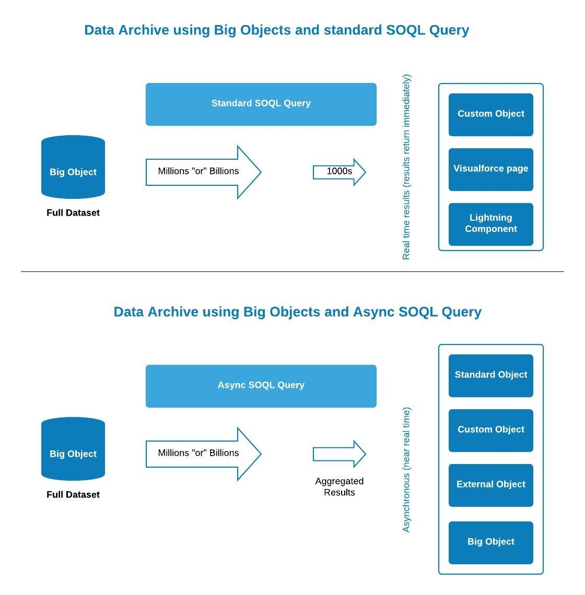

# Salesforce Big Objects

## What are Big Objects?

<ul>
<li>Big objects allow you to store and manage a massive amount of data on the Salesforce platform.</li>
<li>Big objects provide consistent performance for a "billion records or more", and are accessible with a standard set of APIs to your org or external system.</li>
</ul>

There are two flavors of Big objects:

<ol type="1">
<li>Standard Big Objects</li>
Defined by Salesforce and are included in Salesforce products.
<ul>
<li>FieldHistoryArchive (Field Audit Trail product)</li>
<li>FieldHistoryArchive (allows you to store up to ten years’ worth of archived field history data, helping you comply with industry regulations related to auditing and data retention)</li>
</ul>
<li>Custom Big objects</li>
Defined and deployed by you through the Metadata API.
To define a custom Big object, you create:
<ul>
<li>An object file that contains its definition, fields, and index, along with a permissionset to define the permissions for each field, and a package file to define the contents of the object metadata.</li>
<li>The fields defined in a Big object’s index determine the Big object’s identity and its ability to be queried.</li>
</ul>
</ol>

## Create a Custom Big Object
To get started, you need to create at least 2 XML files:
<ol type="1">
<li>An object file = A Big object’s API name is identified with the suffix “__b”.</li>
<li>A permissionset or profile file = By default, access to custom Big objects is restricted.</li>
</ol>

## Populating data in Big Objects
There are two (2) main ways of populating Big objects.
<ol type="1">
<li>You can use a .csv file and Bulk API or SOAP API to upload data into a Big object via Workbench.</li>
<li>Do it entirely in Apex = If you want to use Apex to populate data, use the "insertImmediate" DML operation.</li>
</ol>

## Querying Big Objects
<ol type="1">
<li>standard SOQL</li>
<ul>
<li>If you only need a small dataset from a big object, or if you need the results immediately, use standard SOQL.</li>
</ul>
<li>Async SOQL</li>
<ul>
<li>Async SOQL is implemented via the Chatter REST API.</li>
<li>Async SOQL uses a subset of SOQL commands.</li>
<li>Async SOQL is a way to run SOQL queries in situations where you can’t wait for the results in real time due to the sheer size of the data being queried.</li>
<li>Async SOQL schedules and runs queries asynchronously in the background, so it can run queries that normally time out with regular SOQL.</li>
<li>With Async SOQL, you can run multiple queries in the background while monitoring their completion status.</li>
<li>Async SOQL queries run in the background, and can be run over Salesforce entity data, standard objects, custom objects, and big objects.</li>
<li>Async SOQL is the most efficient way to process the large amount of data in a big object.</li>
<li>Generally, you want to use Async SOQL over standard SOQL when you’re dealing with large amounts of data.</li>
<li>Other Considerations of Async SOQL</li>
<ul>
<li>Async SOQL is included only with the licensing of additional Big Object capacity.</li>
<li>Async SOQL also works on standard and non-big custom objects, but support for those objects is in Pilot.</li>
</ul>
</ul>
</ol>

## When to use SOQL vs Async SOQL?

<table>
	<tr>
		<th colspan="2">SOQL vs Async SOQL</th>
	</tr>
	<tr>
		<th>Use standard SOQL when</th>
		<th>Use Async SOQL when</th>
	</tr>
	<tr>
		<td>
			<ul>
				<li>You want to display the results in the UI without having the user wait for results.</li>
				<li>You want results returned immediately for manipulation within a block of Apex code.</li>
				<li>You know that the query will return a small amount of data.</li>
			</ul>
		</td>
		<td>
			<ul>
				<li>You are querying against millions of records.</li>
				<li>You want to ensure that your query completes.</li>
				<li>You don’t need to do aggregate queries or filtering outside of the index.</li>
			</ul>
		</td>
	</tr>
</table>

## How to use standard SOQL to query Big Objects?
<ul>
<li>For SOQL queries with big objects, you have to build your query starting from the first field defined in the index, without skipping any fields between the first and last field in the query.</li>
<li>If your index defines three fields, you can’t create a query using only the first and third fields.</li>
<li></li>
<li>You can use these comparison operators =, <, >, <=, >=, or IN on the last field in your query.</li>
<li>Any prior fields in your query can only use the = operator.</li>
<li>The !=, LIKE, NOT IN, EXCLUDES, and INCLUDES operators aren’t valid in any query involving big objects.</li>
<li>You can't add a field in filter that is not listed as indexes in Big Object metadata.</li>
<li></li>
</ul>

## How to use Async SOQL to query Big Objects?
There are two (2) main ways to use Async SOQL to get a manageable dataset out of a big object.
<ol type="1">
<li>The first is to use filtering.</li>
<ul>
<li>You can use filtering to extract a small subset of your big object data into a custom object.</li>
<li>You can then use it in your reports, dashboards, or other nifty analytic tool.</li>
</ul>	
<li>The other way to create a manageable dataset is through coarse aggregations.</li>
<ul>
<li>These are the aggregate functions supported by Async SOQL: AVG(field), COUNT(field), COUNT_DISTINCT(field), SUM(field), MIN(field), MAX(field).</li>
<li>Chatter REST API URL = https://yourInstance.salesforce.com/services/data/v41.0/async-queries/</li>
</ul>
</ol>

## High Level Data Archival Solution Design

## Considerations
<ol type="1">
<li>Big Object has its own storage (Storage Usage).</li>
<li>You can define custom big objects only through the Metadata API.</li>
<li>Big objects support only object and field permissions.</li>
<li>Big objects ONLY support custom Salesforce Lightning and Visualforce components.</li>
<li>You can create up to 100 big objects per org.</li>
<li>To support the scale of data in a big object, you can’t use triggers, flows, processes, and the Salesforce app.</li>
<li>Custom Big objects use the CustomObject metadata type.</li>
</ol>

## Salesforce Trailhead
<ul>
<li><a href="https://trailhead.salesforce.com/content/learn/modules/big_objects" target="_blank" alt="Big Objects Basics">Big Objects Basics</a></li>
</ul>

## Salesforce Guide
<ul>
<li><a href="https://developer.salesforce.com/docs/atlas.en-us.216.0.bigobjects.meta/bigobjects/big_object.htm" target="_blank" alt="Big Objects Implementation Guide">Big Objects Implementation Guide</a></li>
</ul>
